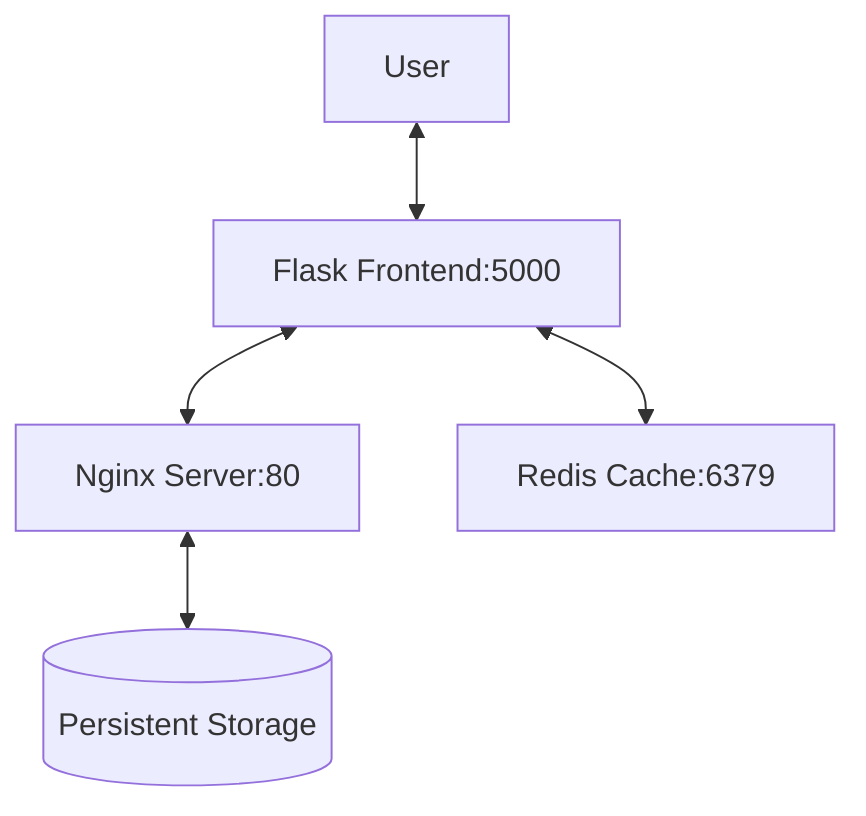

# Content Delivery Network (CDN) Helm Deployment

## Project Overview
A lightweight CDN implementation with three core components:
- **Video Storage Server** (Nginx pod with persistent storage)
- **Cache Layer** (Redis pod)
- **Frontend Service** (Flask app with Nginx proxy)

> **Note**: This is a practice project that can be production-ready with additional security and scaling configurations.

## Prerequisites
- Kubernetes cluster (Minikube, Kind, or cloud provider)
- Helm v3+
- kubectl configured

## Deployment
## Demo
[](./demos.mp4)
### Helm Installation (Recommended)
```bash
# Add Helm repository
helm repo add cdn https://prabhanjanvs.github.io/CDN/
helm repo update

# Install the chart
helm install cdn-deployment cdn/directdeploy --version 1.0.0

### Manual Video Upload

bash

# Download sample video
wget https://download.blender.org/peach/bigbuckbunny_movies/BigBuckBunny_640x360.m4v -O video.mp4

# Upload to storage
kubectl apply -f - <<EOF
apiVersion: v1
kind: Pod
metadata:
  name: video-uploader
spec:
  containers:
  - name: uploader
    image: nginx:alpine
    volumeMounts:
    - name: nginx-storage
      mountPath: /usr/share/nginx/html
  volumes:
  - name: nginx-storage
    persistentVolumeClaim:
      claimName: nginx-storage
EOF

kubectl cp video.mp4 video-uploader:/usr/share/nginx/html/video.mp4

## Accessing the Service

bash

kubectl get svc cdn-deployment-nginx-service

Open  `http://<NODE_IP>:<NODEPORT>`  in your browser to view the video.
```

## Architecture Details

| Component       | Technology | Port  | Description                          |
|----------------|------------|-------|--------------------------------------|
| Video Storage  | Nginx      | 80    | Hosts video files with persistent storage |
| Cache Layer    | Redis      | 6379  | Temporary video metadata caching     |
| Frontend       | Flask+Nginx| 5000  | Streams videos through Nginx proxy   |




| Chart Type       | Location               | Purpose                     |
|------------------|------------------------|-----------------------------|
| Direct Deployment | `/directdeploy`        | Zero-config production setup|
| Configurable     | `/helm`                | Customizable deployment     |

## Scaling to Production

1.  Add TLS termination
    
2.  Configure Redis persistence
    
3.  Implement horizontal pod autoscaling
    

4.  Add monitoring (Prometheus metrics)
