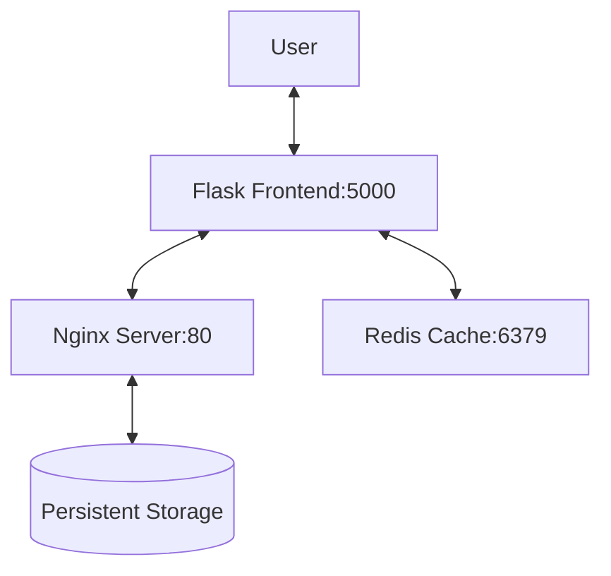

# Content Delivery Network (CDN) Helm Deployment

## Project Overview
A lightweight CDN implementation with three core components:
- **Video Storage Server** (Nginx pod with persistent storage)
- **Cache Layer** (Redis pod)
- **Frontend Service** (Flask app with Nginx proxy)

> **Note**: This is a practice project that can be production-ready with additional security and scaling configurations.

## Prerequisites
- Kubernetes cluster (Minikube, Kind, or cloud provider)
- Helm v3+
- kubectl configured

## Deployment
## Demo
[](./demos.mp4)
### Helm Installation (Recommended)
```bash
# Add Helm repository
helm repo add cdn https://prabhanjanvs.github.io/CDN/
helm repo update

# Install the chart
helm install cdn-deployment cdn/directdeploy --version 0.1.2

### Manual Video Upload

bash

# Download sample video
wget https://download.blender.org/peach/bigbuckbunny_movies/BigBuckBunny_640x360.m4v -O video.mp4

# Upload to storage
kubectl apply -f - <<EOF
apiVersion: v1
kind: Pod
metadata:
  name: video-uploader
spec:
  containers:
  - name: uploader
    image: nginx:alpine
    volumeMounts:
    - name: nginx-storage
      mountPath: /usr/share/nginx/html
  volumes:
  - name: nginx-storage
    persistentVolumeClaim:
      claimName: nginx-storage
EOF

kubectl cp video.mp4 video-uploader:/usr/share/nginx/html/video.mp4

## Accessing the Service

bash

kubectl get svc cdn-deployment-nginx-service

Open  `http://<NODE_IP>:<NODEPORT>`  in your browser to view the video.
```

## Architecture Details

| Component       | Technology | Port  | Description                          |
|----------------|------------|-------|--------------------------------------|
| Video Storage  | Nginx      | 80    | Hosts video files with persistent storage |
| Cache Layer    | Redis      | 6379  | Temporary video metadata caching     |
| Frontend       | Flask+Nginx| 5000  | Streams videos through Nginx proxy   |




| Chart Type       | Location               | Purpose                     |
|------------------|------------------------|-----------------------------|
| Direct Deployment | `/directdeploy`        | Zero-config production setup|
| Configurable     | `/helm`                | Customizable deployment     |

## Scaling to Production

1.  Add TLS termination
    
2.  Configure Redis persistence

3.  Add monitoring (Prometheus metrics)


# GCP Terraform + GKE Deployment

This repository contains Terraform and Kubernetes manifests to provision a VPC and a GKE cluster on Google Cloud and deploy workloads to it. It also shows how to configure cloud credentials, pass the VPC name to the GKE module, and update a Kubernetes Deployment (e.g., to point to an S3 bucket or other object store).

> Example project name used in this README: `demo`

---

## Table of contents

1. Prerequisites
2. Recommended repo layout
3. Files/snippets (providers.tf, terraform.tfvars example)
4. Workflow: VPC -> GKE -> kubeconfig -> Deploy
5. Updating Kubernetes Deployment (bucket link)
6. Destroy/cleanup
7. Troubleshooting and tips

---

## 1. Prerequisites

* Google Cloud account with a project (e.g. `demo`).
* `gcloud` CLI installed and authenticated: `gcloud auth login`
* `terraform` (v1.0+) installed.
* `kubectl` installed.
* Optional: `aws` CLI if you manage an S3 bucket on AWS.
* A service account JSON key (recommended) for Terraform to authenticate to GCP.
* I did however have showed few of my project ids and s3 bucket links, which i will be deleting anyhow. So make and run your own resources.
### Enable required GCP APIs

```bash
PROJECT_ID=demo
gcloud config set project "$PROJECT_ID"
# enable APIs used by terraform and GKE
gcloud services enable compute.googleapis.com container.googleapis.com iam.googleapis.com servicemanagement.googleapis.com
```

### Create a service account and key (recommended)

```bash
gcloud iam service-accounts create tf-deployer --display-name "Terraform Deployer"
# attach roles needed (adjust minimal roles as per your security policy)
gcloud projects add-iam-policy-binding $PROJECT_ID --member="serviceAccount:tf-deployer@$PROJECT_ID.iam.gserviceaccount.com" --role="roles/owner"
# (Prefer more restrictive roles: roles/container.admin, roles/compute.networkAdmin, roles/iam.serviceAccountUser, roles/storage.admin)

# create key
gcloud iam service-accounts keys create ~/gcp-tf-demo-key.json --iam-account=tf-deployer@$PROJECT_ID.iam.gserviceaccount.com
# keep this file safe
```

Set the provider credentials path environment variable (optional for local runs):

```bash
export GOOGLE_APPLICATION_CREDENTIALS="$HOME/gcp-tf-demo-key.json"
```

---

## 2. Recommended repo layout

```
├── vpc/
│   ├── main.tf
│   ├── variables.tf
│   └── outputs.tf
├── gke/
│   ├── main.tf
│   ├── variables.tf
│   ├── outputs.tf
│   └── terraform.tfvars     # copy/edit from root example
├── k8s-deployment/
│   └── deployment.yaml
├── providers.tf             # optional root provider config
├── terraform.tfvars         # root example used for vpc/gke runs
└── README.md
```

> You can keep VPC and GKE in different Terraform directories (recommended for separation of concerns). Run `terraform` from the directory of the module you want to manage.

---

## 3. Provider and terraform.tfvars examples

### `providers.tf` (root or module-level)

```hcl
terraform {
  required_providers {
    google = {
      source  = "hashicorp/google"
      version = "~> 4.0"
    }
  }
  required_version = ">= 1.0"
}

provider "google" {
  project = var.project
  region  = var.region
  zone    = var.zone

  # Option 1: use file path
  credentials = file(var.credentials_path)

  # Option 2: rely on GOOGLE_APPLICATION_CREDENTIALS env var
}
```

### `terraform.tfvars` (example)

```hcl
project = "demo"
region  = "asia-south1"       # e.g. Mumbai
zone    = "asia-south1-a"
credentials_path = "~/gcp-tf-demo-key.json" # or absolute path

# VPC-specific
vpc_name = "demo-vpc"
subnet_cidr = "10.10.0.0/16"

# GKE-specific
gke_cluster_name = "demo-gke"
node_count = 3
machine_type = "e2-medium"
network = "${vpc_name}"  # if using same file; otherwise set after vpc creation
```

### Notes

* If you separate VPC and GKE into directories, run the VPC first and consume its outputs for GKE.

Example to read VPC output after creating it:

```bash
# from vpc directory after apply
terraform output -raw vpc_name
# then set it in gke/terraform.tfvars or pass via -var "network=<value>"
```

Or pass the vpc name to your GKE apply directly:

```bash
terraform -chdir=gke init
terraform -chdir=gke apply -var "network=$(terraform -chdir=vpc output -raw vpc_name)"
```

---

## 4. Workflow (detailed)

### A. Create VPC

```bash
cd vpc
terraform init
terraform plan -var-file=../terraform.tfvars
terraform apply -var-file=../terraform.tfvars
```

Make a note of the output `vpc_name` or other outputs you declared.

### B. Create GKE cluster (pass VPC)

Option 1: Edit `gke/terraform.tfvars` and set `network = "demo-vpc"` (value from VPC outputs).

Option 2: Pass the VPC name at runtime:

```bash
# example: passing vpc name from vpc outputs into gke apply
VPC_NAME=$(terraform -chdir=vpc output -raw vpc_name)
cd gke
terraform init
terraform plan -var "network=$VPC_NAME" -var-file=../terraform.tfvars
terraform apply -var "network=$VPC_NAME" -var-file=../terraform.tfvars
```

### C. Get cluster credentials (so kubectl can talk to GKE)

After GKE is created, run either `gcloud` command or use Terraform output (if cluster endpoint and name are outputted). Typical command:

```bash
gcloud container clusters get-credentials demo-gke --region asia-south1 --project demo
# or if zone based
#gcloud container clusters get-credentials demo-gke --zone asia-south1-a --project demo

# verify
kubectl get nodes
```

If you used Workload Identity or private clusters, follow the additional steps required for auth and networking.

### D. Deploy Kubernetes manifests

Edit `k8s-deployment/deployment.yaml` to point to your bucket or image links. Example:

```yaml
apiVersion: apps/v1
kind: Deployment
metadata:
  name: video-app
spec:
  replicas: 2
  selector:
    matchLabels:
      app: video-app
  template:
    metadata:
      labels:
        app: video-app
    spec:
      containers:
      - name: app
        image: your-registry/video-app:latest
        env:
        - name: VIDEO_BUCKET_URL
          value: "https://s3.us-west-1.amazonaws.com/your-bucket/path"
        ports:
        - containerPort: 8080
```

Apply it:

```bash
kubectl apply -f k8s-deployment/deployment.yaml
kubectl get pods -w
```

---

## 5. Using S3 (AWS) vs GCS

*  I have an S3 bucket in the USA region and run the GKE cluster in `south-asia` region. Plan to remove the S3 bucket later and use a common bucket. Both work; change the `VIDEO_BUCKET_URL` accordingly.

* If you want to make it cross-cloud:

  * Keep URLs in `k8s-deployment/deployment.yaml` as an environment variable or ConfigMap.
  * If your app uses signed URLs or SDKs, ensure credentials for the chosen provider (AWS or GCP) are available to the pods (via Secrets or Workload Identity).

---

## 6. Destroy / cleanup

When you want to remove resources:

```bash
# Destroy GKE
cd gke
terraform destroy -var "network=$VPC_NAME" -var-file=../terraform.tfvars

# Destroy VPC
cd ../vpc
terraform destroy -var-file=../terraform.tfvars
```

Also remove the service account key from where you stored it, if needed:

```bash
rm ~/gcp-tf-demo-key.json
```

---

## 7. Troubleshooting & tips

* If Terraform complains about credentials, ensure `credentials = file(var.credentials_path)` points to an absolute path or set `GOOGLE_APPLICATION_CREDENTIALS` environment variable.
* For private GKE clusters, make sure your machine has authorized network access (bastion or authorized networks) to fetch credentials or run `gcloud` with proper flags.
* Prefer using Workload Identity for GKE pods instead of mounting long-lived service account keys into containers.
* Consider using Terraform state backends (remote state) like GCS bucket for team use:

```hcl
terraform {
  backend "gcs" {
    bucket = "my-terraform-state-bucket"
    prefix = "terraform/state"
  }
}
```

* Monitor costs: deleting clusters and computing resources promptly avoids charges.

---

## Example useful commands (summary)

```bash
# VPC
cd vpc
terraform init
terraform apply 
# GKE (passing network from vpc output)
VPC_NAME=$(terraform -chdir=vpc output -raw vpc_name)
cd gke
terraform init
terraform apply 
# Get credentials & deploy
gcloud container clusters get-credentials demo-gke --region asia-south1 --project demo
kubectl apply -f ../k8s-deployment/deployment.yaml

# Destroy
terraform destroy -var "network=$VPC_NAME" -var-file=../terraform.tfvars
cd ../vpc
terraform destroy -var-file=../terraform.tfvars
```

---

---

*Happy provisioning!*


